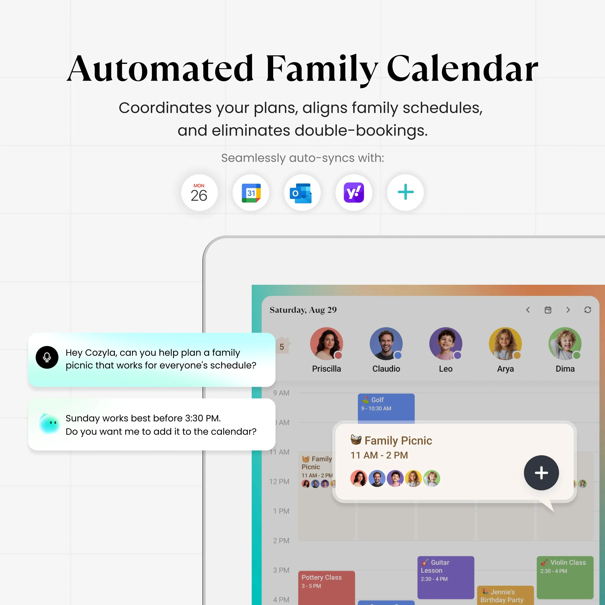
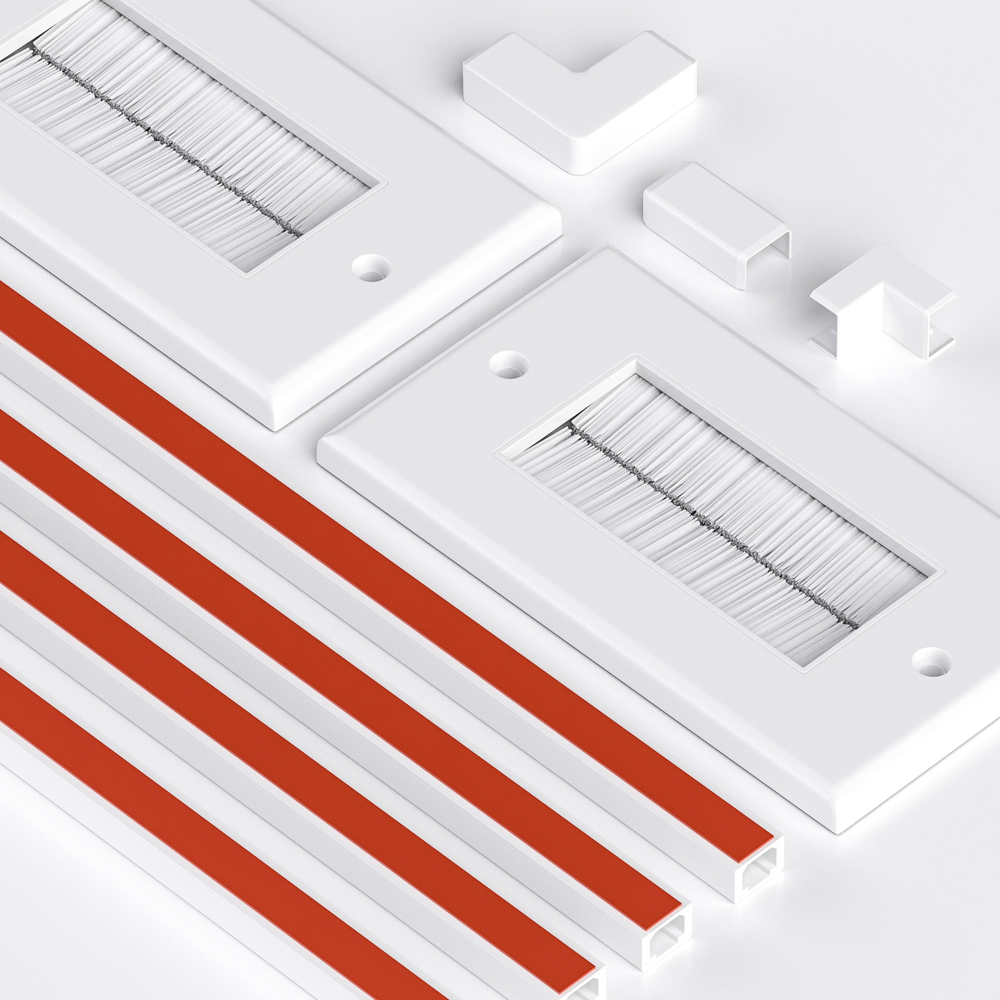
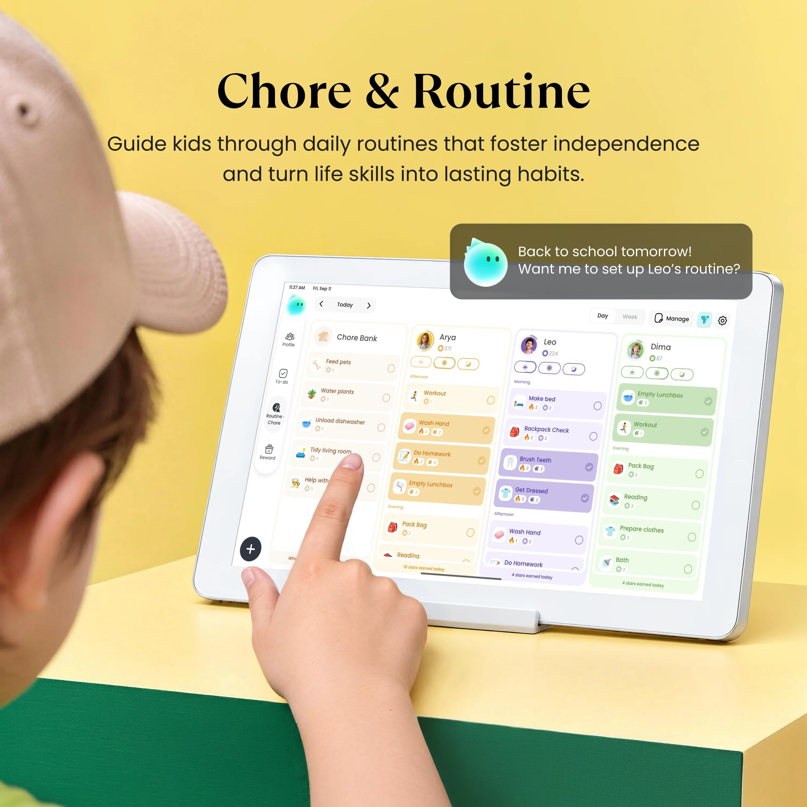
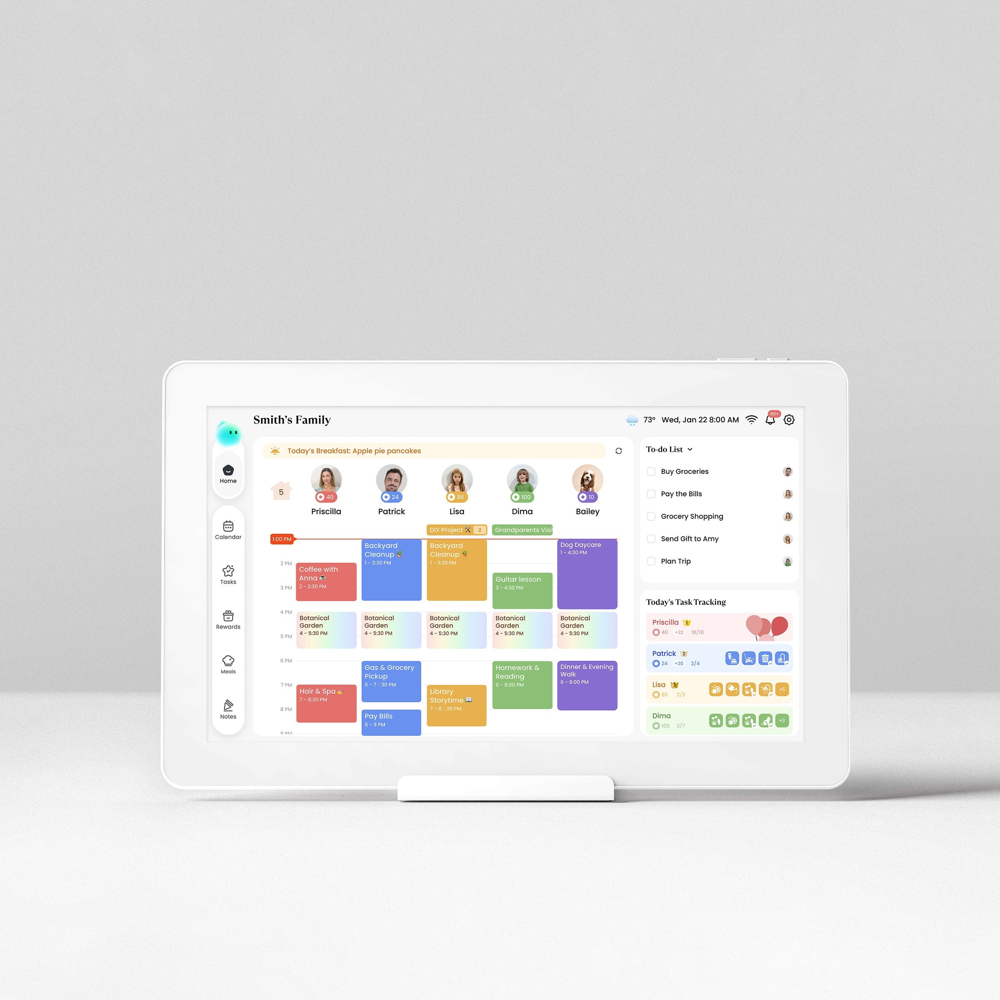

# Cozyla Calendar Review: The Ultimate Subscription-Free Smart Family Hub

> **FTC Affiliate Disclosure:** *When you buy through links on our site, we may earn an affiliate commission at no extra cost to you. As an Amazon Associate, we earn from qualifying purchases. We independently test and rigorously evaluate every smart home product we recommend.*

---

### 🏆 Editor's Choice: Best Smart Family Calendar 2026 — 9.7/10

**The Gold Standard in Digital Family Command Centers: Zero Subscriptions, Seamless Multi-User Sync, and Complete Privacy.**

[👉 Check Current Price on Amazon (ASIN: B0CKX7T26H)](https://www.amazon.com/dp/B0CKX7T26H?tag=siliconsteals-20)

---

### The Hook & Overview: Taming Modern Family Scheduling Chaos

Modern household logistics have reached a boiling point. Between overlapping soccer practices, pediatric dental visits, shifting school project deadlines, and mentally juggling dinner plans, the humble refrigerator whiteboard has collapsed under pure cognitive overload. The **Cozyla Calendar+ 2 (15.6" / 24")** steps into this domestic chaos not as another distraction-heavy entertainment tablet, but as an intentional, purpose-built digital family command center. By replacing smeared dry-erase ink and fragmented phone notifications with a bright, persistent, and centralized touchscreen hub, Cozyla bridges the daily communication divide between parents, kids, and caregivers. Whether mounted on your kitchen command wall or parked on an island countertop, it provides the entire household with a single, synchronized source of truth that family members of all ages can actually see, read, and trust.

### The Zero-Subscription Killer Advantage: Lifetime Freedom from Paywalls

Where Cozyla fundamentally disrupts the smart home display category is its uncompromising, lifetime zero-subscription policy. Primary competitors in the digital calendar space have built notorious walled gardens: the **Skylight Calendar** holds essential daily utilities—including chore charts, meal planners, and photo screensavers—hostage behind an aggressive **$79/year Skylight Plus paywall**, while the **Hearth Display** mandates a perpetual **$9/month ($108/year)** membership just to remain functional. Cozyla flips this exploitative recurring-revenue model on its head. Out of the box, you receive unrestricted two-way multi-calendar synchronization, customizable chore routines, interactive star rewards, weekly meal planning, shared grocery checklists, and cloud photo albums for exactly **$0 per month for life**. Over a typical 3-to-5-year hardware lifecycle, choosing Cozyla saves families between $240 and $540 in hidden software tax alone.

---

*Seamlessly wall-mounted or kickstand-ready: Cozyla transforms busy family entryways and kitchens.*

---

### Display Hardware & Effortless Calendar Sync: Purpose-Built Clarity

From an engineering and usability standpoint, the Cozyla Calendar+ 2 is optimized specifically for high-glare kitchen and living areas. Its 15.6-inch 1080p Full HD IPS touchscreen delivers wide 178-degree viewing angles and features a premium matte anti-glare finish that diffuses harsh recessed kitchen lighting while repelling greasy toddler fingerprints. An internal gravity sensor allows the frame to effortlessly auto-rotate between portrait mode (perfect for tall daily agendas and long chore checklists) and landscape mode (ideal for comprehensive full-month multi-user grids). Calendar ingestion is equally flawless: Cozyla executes bi-directional cloud synchronization across Google Calendar, Apple iCloud, Microsoft Outlook, and Cozi feeds. Whether a parent inputs a doctor visit on an iPhone via Apple Calendar or accepts a school event through corporate Outlook, the update populates across the Cozyla screen in near real-time without requiring manual refreshes or clunky bridge apps.

### Gamified Chore Routines & Meal Planning: Fostering Child Independence

Beyond raw calendar scheduling, Cozyla excels at eliminating morning and bedtime parent nagging through gamification. Up to 8 family members receive personalized color-coded profiles with dedicated avatars, allowing kids to quickly identify their daily responsibilities. The interactive chore management engine empowers parents to build custom recurring routines—from packing school lunches and making beds to feeding pets and completing instrument practice. When children check off completed tasks on the responsive touchscreen, the display triggers celebratory sound effects and awards bankable star points toward parent-approved rewards like weekend movie nights or extra screen time. Paired alongside an intuitive drag-and-drop weekly meal planner that automatically exports ingredient checklists to the Cozyla iOS/Android companion app, the device systematically streamlines the entire household's mental workload.

---

*Gamified chore boards with star rewards encourage daily accountability and routine mastery for kids.*

---

### Smart Home Openness & Absolute Privacy: No Cameras, Total Control

Unlike closed proprietary appliances that lock you into a single company's limited ecosystem, Cozyla runs an open Android foundation (**CalendarOS**) backed by certified Google Play Store access. This makes it a dream appliance for smart home enthusiasts: you can install the official Home Assistant companion app for rich Lovelace dashboard controls, stream background cooking playlists via Spotify, or pull up video recipe tutorials on YouTube. Just as critical is Cozyla’s ironclad commitment to family privacy: the hardware is intentionally manufactured with **zero on-board cameras**. In an era where mainstream smart screens like the Amazon Echo Show 15 constantly watch your living space and pepper you with unsolicited sponsored shopping ads, Cozyla respects your home sanctuary with an ad-free, clutter-free user experience and far-field microphones reserved strictly for Alexa voice timers and natural-language calendar entries.

### The Purchasing Verdict: The Undisputed Smart Family Gold Standard

While the Cozyla Calendar+ 2 stands as the most capable family organizer on the market, prospective buyers should weigh two practical realities: it requires continuous AC power via its included 12V DC adapter—meaning flush wall mounting requires thoughtful cord management or a recessed outlet—and it commands a higher upfront investment ($349.99 MSRP for the 15.6" model) than repurposing a budget consumer tablet. However, when measured against recurring competitor subscriptions, superior matte display clarity, and the profound daily calm it brings to hectic family mornings, the investment pays for itself within months. For busy parents, neurodivergent households navigating ADHD visual routine schedules, and tech-savvy families demanding open smart home versatility, the Cozyla Calendar+ 2 earns our unconditional Editor's Choice recommendation as the finest smart family calendar of 2026.

---

*Equipped with an integrated desktop kickstand for counter placement and VESA 100x100 mounting.*

---

## Quick Glance Specifications Matrix

| Specification | Cozyla Calendar+ 2 (15.6") | Cozyla Calendar+ 2 (24") | Skylight Calendar (15") |
| :--- | :--- | :--- | :--- |
| **Display Size & Type** | 15.6-inch IPS Full HD | 23.8-inch IPS Full HD | 15.0-inch Touchscreen LCD |
| **Resolution & Finish** | 1920 × 1080 (Anti-Glare Matte) | 1920 × 1080 (Anti-Glare Matte) | 1920 × 1080 (Glossy/Slight Glare) |
| **Operating System** | CalendarOS (Android base) | CalendarOS (Android base) | Proprietary Closed Kiosk OS |
| **App Ecosystem** | Google Play Store Certified | Google Play Store Certified | Closed (No app store) |
| **Calendar Sync Support**| Google, Apple iCloud, Outlook, Cozi, CalDAV | Google, Apple iCloud, Outlook, Cozi, CalDAV | Google, Apple, Outlook, Yahoo |
| **Mandatory Subscription**| **$0.00 / Life (FREE)** | **$0.00 / Life (FREE)** | **$39 – $79 / Year (Skylight Plus)**|
| **Core Features Free?** | Yes (Sync, Chores, Meals, Photos)| Yes (Sync, Chores, Meals, Photos)| No (Chores/Meals locked behind sub)|
| **Integrated Camera** | **None (100% Privacy-Safe)** | **None (100% Privacy-Safe)** | None |
| **Audio & Voice** | Dual 2W Stereo + Far-Field Mics | Dual 3W Stereo + Far-Field Mics | Dual Speakers (No Alexa native) |
| **Orientation & Mount** | Auto-Rotating VESA 100×100 + Kickstand | Auto-Rotating VESA 100×100 + Bracket | Desktop Stand / Wall Mount |
| **Amazon ASIN** | `B0CKX7T26H` | Direct / Multi-Retailer | `B0CXYZ1234` (Ref) |

---

## Pros & Cons: At a Glance

| Strengths (Pros) | Considerations & Trade-Offs (Cons) |
| :--- | :--- |
| ✅ **100% Subscription-Free:** Zero monthly or yearly fees for calendars, chore charts, meal planners, or photo sync. | ❌ **Continuous AC Power Required:** Lacks internal battery; wall mounting requires cord management or in-wall outlet. |
| ✅ **Vibrant Anti-Glare Matte Display:** 1080p IPS panel diffuses harsh overhead light and repels fingerprint smudges. | ❌ **Higher Initial Upfront Cost:** Substantial initial hardware investment compared to repurposing an iPad. |
| ✅ **True Two-Way Synchronization:** Real-time sync with Google Calendar, Apple iCloud, Outlook, Yahoo, and Cozi. | ❌ **Apple Setup Nuance:** Apple iCloud calendar integration requires generating an Apple App-Specific Password. |
| ✅ **Gamified Chore & Reward System:** Star reward bank motivates children and automates morning/bedtime routines. | ❌ **Modest Speaker Bass:** 2× 2W speakers are crisp for voice timers and podcasts, but lack deep bass for party music. |
| ✅ **Open Android OS & Play Store:** Run Home Assistant for wall dashboards, Spotify, YouTube recipes, and weather radars. | ❌ **App Scaling in Portrait:** Select third-party Android apps may default to landscape orientation. |
| ✅ **100% Hardware Privacy:** Zero onboard cameras eliminate snooping and intrusive shopping ad trackers. | |
| ✅ **Flexible Dual Orientation:** Auto-rotates between portrait (chore focus) and landscape (full month calendar). | |

---

### Ready to Eliminate Family Scheduling Chaos?

**Get the Cozyla Calendar+ 2 today and enjoy lifetime zero-subscription family organization.**

[👉 Check Current Price & Availability on Amazon](https://www.amazon.com/dp/B0CKX7T26H?tag=siliconsteals-20)

*(Model: Cozyla Calendar+ 2 15.6" | ASIN: B0CKX7T26H | Includes Desktop Kickstand & Wall Mount Kit)*

